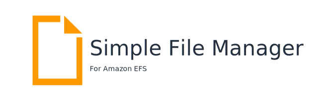

Simple File Manager provides access to Amazon EFS through a RESTful API and responsive web app. Together, these components allow you the ability to manage data in your Amazon EFS filesystem from any location or device that can access the internet. You simply log-in to the Simple File Manager application from a web browser and directly upload, view, delete, or download data from any filesystem in your AWS account. All without the need to setup or maintain any dedicated EC2 or networking infrastructure.

You can deploy the open source solution by clicking one of the one-click deployment links in the install section below.

***Note: This project is in an early beta stage. Please report bugs if you find them.***

# Install

Region| Launch
------|-----
US East (N. Virginia) | 
US West (Oregon) | 

# Getting Started

1. Launch the solution by clicking a one click link for the desired region.
    * *Make sure to review the [installation parameters](#installation-parameters) section.*
2. Follow the stack creation prompts in CloudFormation.
3. When the deployment is completed, you will find the URL to the application in the "Outputs" tab of the stack.
4. Navigate to the application URL in a web browser.

*During stack creation, you will have received an email containing your initial login credentials.*

5. Use the inital credentials to sign in. You will be required to create a new password. 
6. Upon successful authentication, the application will route you to the home page, where you will see all the EFS Filesystems in your account for the selected region.
7. To grant Simple File Manager access to a file system, click the link labeled "false". This will take you to the file manager lambda creation page.
8. In the form, fill out the required input fields. Leave them at their default values if you're unsure what the options are.
9. Click submit and wait for the application to complete the request.
10. After completion, you will be routed back to the home page.

*Lambda can take several minutes to provision a new function. Please allow 1-2 minutes if the managed state returns "Creating" and refresh the page.*

11. The link previously labeled false now returns true and the file system id is now a clickable link.
12. Click on the file system id link to access the file system. 

The application will route you to the file system page, where you can now perform file system operations. The current supported operations are: *List*, *Make directory*, *Upload*, *Download*, and *Delete.*

# Cost

The cost to deploy and use the solution is minimal due to its serverless architecture, which means users pay a small fee per request, rather than an always-on fee. In most cases the cost will fall entirely within the AWS Free Tier.

# Installation Parameters

## Required parameters

**Stack Name**: The name of the stack.

**Admin Email**: The email address that will be used by the application Admin. The inital credentials will be sent to this address.

# Architecture

*A detailed architecture diagram can be found in the docs directory* 

___

Copyright 2019 Amazon.com, Inc. or its affiliates. All Rights Reserved.

Licensed under the Apache License Version 2.0 (the "License"). You may not use this file except in compliance with the License. A copy of the License is located at

    http://www.apache.org/licenses/

or in the "license" file accompanying this file. This file is distributed on an "AS IS" BASIS, WITHOUT WARRANTIES OR CONDITIONS OF ANY KIND, express or implied. See the License for the specific language governing permissions and limitations under the License.
